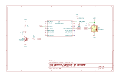

## Daikin AC Infrared Controller for ESPHome

Works with Daikin AC model FTXM50QVMA, enabling automation of the functionality of remote control unit model ARC466A28.

Uses a [Seeedstudio Xiao ESP32C3](https://www.seeedstudio.com/Seeed-XIAO-ESP32C3-p-5431.html) and DS18B20 temperature sensor.

